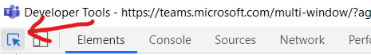
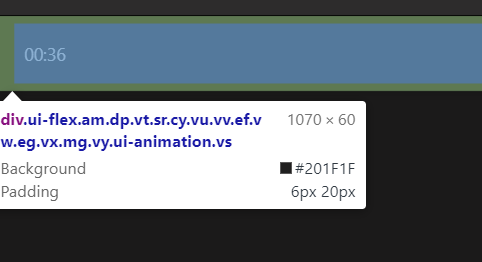

# A guide to modifing Microsoft Teams (with JavaScript)

First, a little background on what this is. It is a guide to what I have figured out in Microsoft Teams. I wanted to be able to add features that I could not do normally. I was able to open the developer tools, but I was unable to find any useful reference on the internal HTML or how it works. In this Gist, I attempt to document everything I have figured out how to do _only using the JavaScript console in the DevTools_. This is _not_ a reference guide or documentation, but it does contain what I have figured out how to do. This repo is meant as a cookbook, of (hopefully) useful things you can do. All of these experiments assume you are in the JavaScript console within DevTools. So read Opening DevTools before you try these.

## A bit of useful information

I test these on Windows 10, with the Teams Developer Preview enabled, and the New Meeting Experiance on

## Opening DevTools

> Note on the "New Meeting Experience"
> Doing these with the new meeting experience is more complex. The experiment with changing the font, for example, is designed for the "main" Teams windows, so it should work unchanged. The one to get the particiapants is for the meeting window. To get the DevTools for the Meeting window (when you are in a meeting), do `DevTools > Open DevTools (All WebContents)`. This will open a TON (like five or six) DevTools windows. Two will have a title that looks something like `Developer Tools - https://teams.microsoft.com/multi-window/?agent=electron&version=xxxxxxxxx`. Close the DevTools windows that do NOT havve that as their title. For the remaining two, click the button the arrow points at:  Then hover the mouse over the meeting window. If it lets you select "things" in the window, that is the right one. Hovering over something will ideally look something like this: 

Enable developer mode (https://docs.microsoft.com/en-us/microsoftteams/platform/resources/dev-preview/developer-preview-intro) using the desktop version of Teams on Windows 10. Click on the Teams icon in the tray ten (or more) times quickly. Then right-click on the icon and do `DevTools > Open DevTools (Main Window)`. __Do NOT simply do `Open DevTools`. While that does show dev tools, it does not show the ones needed for modifying the Teams app (as far as I can tell).__  This is for the "main" Teams window.

### A quick note about the other DevTools windows
When one does what I describe above (for the new meeting experiance), it shows many (six-ish) DevTools windows. I am going to try to explain what they are:
- `Developer Tools - https://teams.microsoft.com/_?style=%22%22` - This is the main window of Teams
- The one that says "DevTools was disconnected from the page" I have no idea
- `File:///C:/Users/******/AppData/Local/Microsoft/Teams/current/resources/app.asar/lib/render/notifications/notifications.html` - This represents the notifications. So if you run the Changing the font snippet in this one, it will change the font for [Teams] notifications
- `Developer Tools - about:blank`. I think `about:blank` represents a blank or probobly hidden page? Mayber it is used to clear a window? I don't know for sure

## Changing the font
As a proof-of-concept, lets change the font of Teams to Comic Sans. In the JavaScript console run: `for(let i = 0; i < document.getElementsByTagName("*").length; i++) {document.getElementsByTagName("*")[i].style.fontFamily="Comic Sans MS"}`. This will change the font to Comic Sans.

Note: You _might_ be able to do this without being in Developer Mode, by simply rapidly clicking on the Teams icon (as specified above), but I test these in Developer Mode.

## Listing everyone in the meeting
> This requires you to have the _Participants_ tab open in the meeting. If you don't, this won't work. Also, remember to close the "Others invited" tab in participants. If you don't close it, those names will be included

### Printing everyone in the meeting

In the JavaScript console, run this: `for(const item of Array.from(document.getElementsByTagName('li'))){console.log(item.children[1].innerText.split("\n")[0]);}`. It will print out each name.

### But I don't want to print it, I want an array

As an array, use this: `var a = []; for(const item of Array.from(document.getElementsByTagName('li'))){a.push(item.children[1].innerText.split("\n")[0]);}`. The names will be stored in the array `a`.

## I want to undo my changes/go back to the normal um-modified Teams

Go into the tray (the Teams icon), right click it, and click `Quit`. Then re-open Teams. Your changes will be gone. Note that this applies to changes to the HTML only (this is the only kind of change explained in this Gist), but if you modify the actually install, this (probably) won't work.

## References
- [(How) can I open the dev tools in the Microsoft Teams desktop client?](https://stackoverflow.com/a/59403509)
- [how to iterate on HTMLCollection?](https://stackoverflow.com/a/4995628)

## TODO:
> These are things that I hope to add
- [ ] Detect when someone has raised their hand
